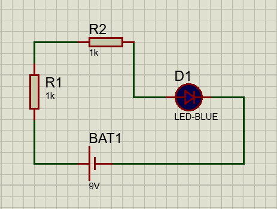

Repositório referentes ao circuitos criados na disciplina de Sistemas Embarcados 2023

Aluno.: Lucas Tatin
Professor: Rafael Rodrigues Barbosa

------------------------------------------------------

Neste projeto (circuito), foi elaborado em um programa de simulação, um retificador de onda de corrente elétrica. 

------------------------------------------------------

<h1>Schematic Capture<h1>

Esquematico do circuito de retificador de onda com ponte de diodo

------------------------------------------------------

<h1>Schematic Capture<h1>

Esquematico do circuito de retificador de onda com diodo manual

------------------------------------------------------

<h1>Pcb Layout<h1>

Pcb layout do circuito de retificador de onda com ponte de diodo

------------------------------------------------------

<h1>Pcb Layout<h1>

Pcb layout do circuito de retificador de onda com diodo manual

------------------------------------------------------

<h1>3d Visual<h1>

3d Visual do circuito de retificador de onda com ponte de diodo, parte superior

------------------------------------------------------

<h1>3d Visual<h1>

3d Visual do circuito de retificador de onda com ponte de diodo, parte inferior

------------------------------------------------------

<h1>3d Visual<h1>

3d Visual do circuito de retificador de onda com diodo manual, parte superior

------------------------------------------------------

<h1>3d Visual<h1>

3d Visual do circuito de retificador de onda com diodo manual, parte inferior

------------------------------------------------------

<h1>Schematic Capture Tinkercad<h1>

Esquematico do circuito de retificador de onda com diodo manual, feito no Tinkercad

------------------------------------------------------

<h1>Funcionamento de um Retificador<h1>

O retificador de onda completa converte ambas as metades de cada ciclo de forma de onda em sinal DC pulsante usando quatro diodos de retificação

------------------------------------------------------

Para este projeto foi utilizado dois programas bem uteis para montar circuitos,
e modelagem em 3D, trata-se do Proteus e Tinkercad

------------------------------------------------------

<h1>Proteus<h1>

Programa bastante utilizado para montar circuitos, onde temos a visão do Esquematico, do Pcb Layout
e a Visão 3D

------------------------------------------------------

<h1>Tinkercad<h1>

Programa bastante utilizado para montar estruturas em 3D, seja ela um circuito,
uma maquete de uma máquina, entre outros

------------------------------------------------------
