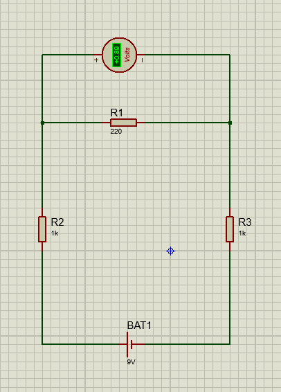
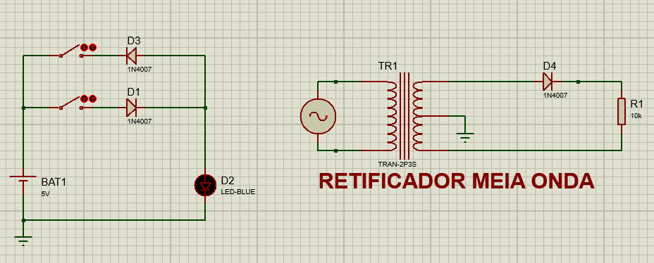
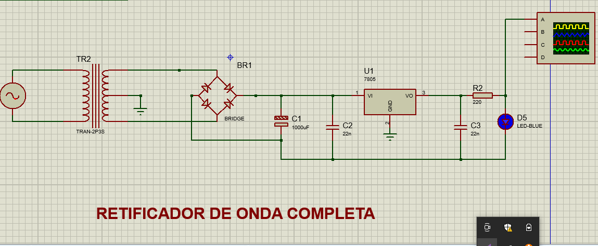
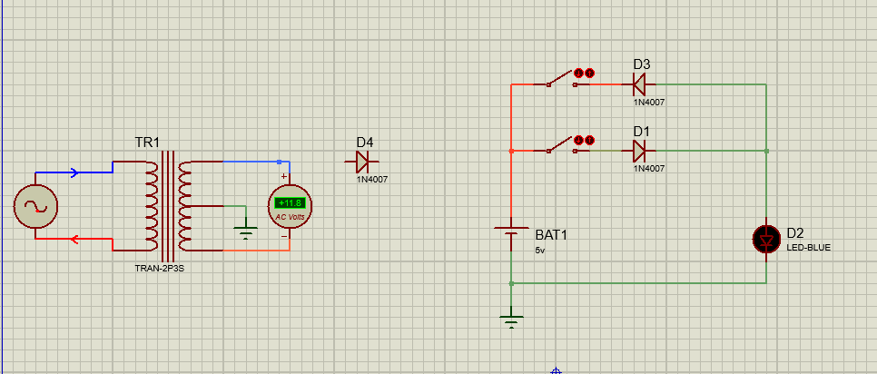
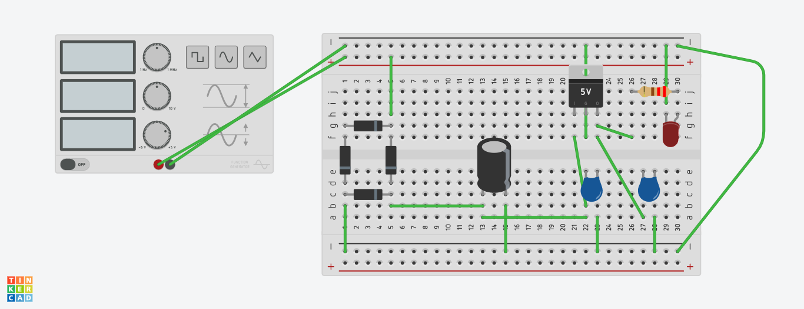
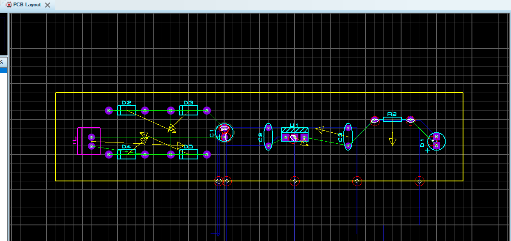

Repositório referentes ao circuitos criados na disciplina de Sistemas Embarcados 2023

Aluno.: Lucas Tatin
Professor: Rafael Rodrigues Barbosa

_________________________________________________________________________________

<h1>Proteus Protoboard<h1>

Simulação do circuito de retificador de onda com ponte de diodo

_________________________________________________________________________________

<h1>Proteus Protoboard<h1>

Simulação referente ao circuito de um retificador de onda com diodo manual

_________________________________________________________________________________

<h1>Proteus Protoboard<h1>

Simulação de um retificador de meia onda

_________________________________________________________________________________

<h1>Proteus Protoboard<h1>

Simulação de um retificador de onda completa

_________________________________________________________________________________

<h1>Proteus Protoboard<h1>

Alguns circuitos feitos em sala de aula também

_________________________________________________________________________________

<h1>Tinker Cad<h1>

Circuitos feitos na aula 4

________________________________________________________________________________

<h1>Pcb Layout<h1>

Pcb layout do circuito de retificador de onda com diodo manual

_________________________________________________________________________________

<h1>FUNCIONAMENTO DE UM RETIFICADOR<h1>

Normalmente, os diodos retificadores são ligados a uma fonte de energia e desta forma é gerada uma tensão elétrica, que pode ser direta ou reversa. Caso os terminais positivos dos diodos retificadores sejam ligados aos terminais positivos da fonte de energia, ocorre um processo conhecido como polarização direta.

_________________________________________________________________________________

